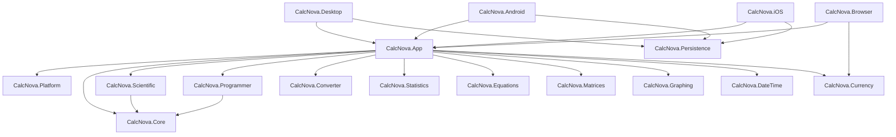

# CalcNova Architecture

## Status

This document describes the completed CalcNova 2.8.03 source architecture.

CalcNova uses a feature-first modular .NET solution with MVVM at the shared Avalonia presentation boundary. Mathematical/domain code is separated from UI/platform composition so the same behavior can be reused across Desktop, Browser/WebAssembly, Android, and iOS.

## Architectural goals

The architecture is designed to preserve:

- mathematical correctness;
- deterministic domain behavior where applicable;
- testability;
- cross-platform reuse;
- local-first privacy;
- accessibility and adaptive UI behavior;
- explicit workload/input bounds;
- maintainable dependency direction;
- thin platform heads;
- replaceable platform/network/storage services.

## Solution layout

`CalcNova.All.slnx` groups the current source projects into three source layers.

### Domain modules

- `CalcNova.Core`
- `CalcNova.Scientific`
- `CalcNova.Programmer`
- `CalcNova.Converter`
- `CalcNova.Statistics`
- `CalcNova.Equations`
- `CalcNova.Matrices`
- `CalcNova.Graphing`
- `CalcNova.DateTime`
- `CalcNova.Currency`

### Application/infrastructure modules

- `CalcNova.Platform`
- `CalcNova.Persistence`
- `CalcNova.App`

### Platform heads

- `CalcNova.Desktop`
- `CalcNova.Android`
- `CalcNova.iOS`
- `CalcNova.Browser`

The solution also contains focused test projects for the domain, persistence, and application layers.

## Dependency direction

The intended dependency direction is:



The diagram is a responsibility/dependency overview rather than a replacement for project-reference metadata. Actual `.csproj` references remain the source of truth.

Domain projects must not depend on Avalonia UI or platform entry points. Platform heads should remain composition/startup layers rather than duplicate calculator logic.

## `CalcNova.Core`

`CalcNova.Core` owns the shared calculation foundation, including:

- numeric representation;
- tokenization;
- recursive-descent parsing;
- expression syntax;
- evaluation;
- formatting/error contracts;
- angle mode and workload options;
- exact rational arithmetic;
- engineering notation utilities;
- reusable safety limits.

The calculator does not execute user expressions as source code.

## Parser/evaluator pipeline

The expression pipeline is:

```text
raw expression
  -> tokenizer
  -> token sequence
  -> recursive-descent parser
  -> expression syntax tree
  -> expression evaluator
  -> NumberValue / typed calculation error
```

Precedence is explicit. Exponentiation is right-associative. Unary minus has lower precedence than exponentiation, so `-2^2` is interpreted as `-(2^2)`.

Input and numerical workload bounds are part of the architecture, not optional UI validation.

## Numeric strategy

CalcNova deliberately does not use binary floating point for every operation.

The calculation stack uses:

- `BigInteger` for arbitrary-precision integer paths;
- `decimal` where decimal arithmetic is appropriate;
- bounded finite `double` paths for transcendental/numerical operations that require floating-point mathematics;
- exact `BigInteger` rational representation for the exact-rational utility.

Numerical approximation features are labeled and bounded. Changes to numeric semantics require regression coverage and corresponding documentation updates.

## Typed error model

Calculation failures use typed errors rather than raw exceptions as normal user-facing results.

The error model covers categories such as:

- syntax errors;
- divide-by-zero;
- domain errors;
- invalid arguments;
- unsupported operations/functions;
- overflow/non-finite boundaries;
- input limits;
- workload limits.

The UI translates application/domain failures into user-facing messages rather than exposing stack traces.

## Feature modules

### `CalcNova.Scientific`

Organizes scientific calculation behavior around the shared evaluator and scientific function contracts.

### `CalcNova.Programmer`

Owns developer-oriented integer behavior:

- radix parsing/formatting from base 2 through 36;
- fixed word-size interpretation;
- signed/unsigned two's-complement behavior;
- bitwise operations;
- shifts;
- bit-grid representation.

`BigInteger` is used so the domain model is not artificially restricted to machine-sized arithmetic internally.

### `CalcNova.Converter`

Owns fixed physical/data unit definitions and conversion logic.

Offline fixed-unit conversion is deterministic and does not require network access. User preferences such as precision, recent pairs, favorites, and selection are persisted through application-facing settings contracts.

### `CalcNova.Statistics`

Owns descriptive and paired statistical analysis, including bounded dataset parsing, covariance, correlation, regression, coefficient of determination, and prediction behavior.

### `CalcNova.Equations`

Owns equation-solving domain workflows, including quadratic analysis used by the shared application.

### `CalcNova.Matrices`

Owns matrix operations such as determinant, inverse, rank, and linear-system solving.

### `CalcNova.Graphing`

Owns graph-domain and numerical-analysis behavior, including:

- bounded function sampling;
- discontinuity segmentation;
- viewport-related calculation models;
- derivative approximation;
- bracketed bisection root finding;
- Simpson integration;
- CSV/SVG-oriented graph data contracts;
- explicit numerical workload safeguards.

Graphing reuses CalcNova mathematical expression behavior; it does not execute arbitrary user code.

### `CalcNova.DateTime`

Owns date/time calculation utilities such as date differences, calendar arithmetic, business-day helpers, and fixed-duration conversion.

### `CalcNova.Currency`

Owns currency-rate abstractions and conversion behavior. Network-backed rates are replaceable and optional; ordinary calculator operation does not depend on a network service or embedded provider credential.

## `CalcNova.Platform`

`CalcNova.Platform` contains reusable platform-facing abstractions that prevent application/view-model code from directly depending on a specific operating-system API.

Examples include shared boundaries for platform services such as clipboard and external-link behavior.

Platform-specific implementations/adapters are composed by the relevant platform head.

## `CalcNova.Persistence`

Persistence is local-first and split behind application-facing abstractions.

Current architecture includes:

- native SQLite-backed calculation history for native targets;
- Browser-safe history/settings composition for WebAssembly;
- settings repository contracts;
- versioned settings schema;
- legacy/unversioned settings migration;
- fail-closed handling of unsupported future schemas;
- shared decoding/validation rules where native and Browser storage need equivalent behavior.

Cloud synchronization is not part of the default 2.8.03 architecture.

See [SETTINGS_STORAGE_CONTRACT.md](SETTINGS_STORAGE_CONTRACT.md) and [SETTINGS_MIGRATION.md](SETTINGS_MIGRATION.md).

## `CalcNova.App`

`CalcNova.App` owns the shared Avalonia application and presentation layer:

- shared views and view models;
- reusable controls;
- navigation/mode shell;
- calculator editing/session behavior;
- converter/statistics/equation/matrix/graph presentation;
- settings/history/onboarding/About surfaces;
- localization integration;
- accessibility/adaptive UI behavior;
- shared service composition boundaries.

MVVM is used for application state and commands. Code-behind is reserved for genuinely view-specific interaction such as direct key/pointer/focus behavior where moving it into domain state would reduce clarity.

## Platform heads

Platform heads are intentionally thin.

Their responsibilities include:

- application/process startup;
- target framework and package identity;
- platform lifecycle;
- target storage/service composition;
- clipboard/native adapter composition;
- platform metadata/resources;
- target-specific build/signing configuration.

They should not reimplement calculation, conversion, statistics, matrix, or graph domain logic.

### Desktop

`CalcNova.Desktop` is the shared Avalonia desktop entry point for Windows, Linux, and macOS.

### Browser/WebAssembly

`CalcNova.Browser` targets `net10.0-browser` and composes Browser-safe storage with the shared application.

### Android

`CalcNova.Android` targets `net10.0-android`, uses application id `in.sanskar.calcnova`, and composes the shared application for Android.

### iOS

`CalcNova.iOS` targets `net10.0-ios`, uses application id `in.sanskar.calcnova`, and composes the shared application for iOS.

See [PLATFORM_SUPPORT.md](PLATFORM_SUPPORT.md) and [BUILDING.md](BUILDING.md).

## Graph presentation architecture

Graphing is separated into domain/numerical behavior and Avalonia presentation behavior.

The completed shared graph surface provides:

- focusable interaction;
- pointer panning;
- wheel/numpad zoom;
- keyboard pan/reset/fit;
- nearest sampled-point trace;
- multi-series identity/presentation;
- non-color-only line patterns;
- text legend;
- accessible SVG export.

See [GRAPH_INTERACTION.md](GRAPH_INTERACTION.md), [GRAPH_SERIES_PRESENTATION.md](GRAPH_SERIES_PRESENTATION.md), [GRAPH_VIEWPORT_CONTROLS.md](GRAPH_VIEWPORT_CONTROLS.md), and [GRAPH_NUMERICAL_SAFETY.md](GRAPH_NUMERICAL_SAFETY.md).

## Localization architecture

CalcNova uses stable semantic string keys with catalog validation.

The completed baseline includes English and Hindi catalogs for the current semantic key set, persisted culture preference, catalog integrity validation, and reviewed runtime localization across major shared surfaces.

See [LOCALIZATION.md](LOCALIZATION.md) and [LIVE_LOCALIZATION.md](LIVE_LOCALIZATION.md).

## Accessibility/adaptive architecture

Accessibility requirements are part of the shared UI architecture rather than platform-specific afterthoughts.

The baseline includes:

- minimum interaction-target contracts;
- explicit focus visibility;
- stronger high-contrast focus state;
- compact/medium/expanded layout profiles;
- compact overflow behavior;
- focus bring-into-view;
- keyboard mode navigation;
- graph focus/touch contracts;
- onboarding focus/shortcut behavior.

Runtime evidence is recorded separately from source completeness. See [ACCESSIBILITY.md](ACCESSIBILITY.md) and [ACCESSIBILITY_TEST_MATRIX.md](ACCESSIBILITY_TEST_MATRIX.md).

## Dependency policy

A new dependency should be added only when it provides meaningful value that would be costly or risky to implement using the framework/BCL.

Review:

- active maintenance;
- license compatibility;
- target support;
- security history;
- package size;
- API stability;
- testability;
- Browser/mobile compatibility;
- impact on offline/local-first behavior.

## Extension rule

New platform integrations should be introduced behind application-facing abstractions when they would otherwise force shared application/domain code to reference platform APIs.

New mathematical behavior should live in the appropriate domain module, with shared UI orchestration in `CalcNova.App` and platform-specific code only in a thin platform head when unavoidable.

## Architecture review rule

When a change requires a low-level domain project to depend on Avalonia, a platform head, or a higher-level application project, redesign the boundary instead of creating a circular or inverted dependency.

When architecture or project references change, update this document and the relevant build/platform documentation in the same maintenance change.
