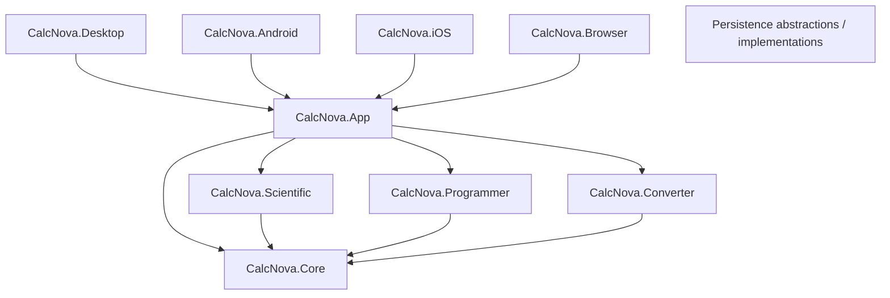

# CalcNova Architecture

## Goals

CalcNova's architecture is designed to preserve mathematical correctness, testability, cross-platform reuse, accessibility, and maintainability while avoiding unnecessary layers.

The project uses a feature-first modular solution with MVVM at the presentation boundary.

## Dependency direction



Platform heads should remain thin. Domain projects must not reference Avalonia UI.

## Projects

### CalcNova.Core

Owns shared calculation primitives:

- numeric representation;
- tokenization;
- parsing;
- expression syntax tree;
- evaluation;
- formatting/error contracts;
- angle mode and workload options.

Core must remain deterministic for identical expression/options inputs and must never execute input as source code.

### CalcNova.Scientific

Provides scientific-mode organization around the shared evaluator. Scientific algorithms that become sufficiently complex can move here while retaining testable pure-C# APIs.

### CalcNova.Programmer

Owns developer-oriented integer behavior:

- radix parsing/formatting;
- fixed word-size interpretation;
- two's complement;
- bitwise operations;
- shifts;
- bit visualization.

It uses `BigInteger` internally so the domain model is not artificially restricted to machine-sized integers.

### CalcNova.Converter

Owns fixed physical-unit definitions and conversion logic. Unit definitions convert through category-specific base units using multiplicative or affine transforms.

Fixed conversions must not require network access.

### CalcNova.Persistence

Currently contains the native SQLite calculation-history implementation and its repository contract.

Long term, persistence contracts should be placed so Browser/WebAssembly does not need to reference native SQLite packages. Platform-specific implementations can then satisfy the same application-facing abstractions.

### CalcNova.App

Owns shared Avalonia UI, view models, reusable controls, navigation, application services, and presentation behavior.

View models may depend on domain abstractions. Domain projects must not depend back on the app.

### Platform heads

Platform heads are responsible only for concerns such as:

- process/application startup;
- target packaging metadata;
- platform lifecycle;
- permissions;
- clipboard/share/haptics/native APIs;
- target-specific storage composition;
- unavoidable native configuration.

They should not contain duplicated calculator logic.

## Parser architecture

The current parser pipeline is:

```text
raw expression
  -> Tokenizer
  -> token sequence
  -> recursive-descent Parser
  -> Expression syntax tree
  -> ExpressionEvaluator
  -> NumberValue / typed error
```

Precedence is intentionally explicit. Exponentiation is right-associative. Unary minus has lower precedence than exponentiation, so `-2^2` is interpreted as `-(2^2)`.

## Numeric strategy

CalcNova does not use binary floating point for every operation.

`NumberValue` currently supports:

- `BigInteger` for exact integers;
- `decimal` for many decimal arithmetic paths;
- finite `double` for transcendental functions and calculations where the BCL mathematical functions require it.

The representation may evolve as rational/complex/exact-result features are added. Numeric changes require regression tests and documentation.

## Error model

Calculation failures are represented with typed error codes including syntax errors, divide-by-zero, domain errors, overflow, invalid arguments, unsupported functions, input limits, and workload limits.

Ordinary UI should display human-readable messages instead of stack traces.

## State and MVVM

View models expose UI state and commands. Code-behind is reserved for genuinely view-specific behavior such as direct key events or visual interaction that would be less maintainable as domain state.

As the app expands, services will own clipboard, history, preferences, external links, sharing, and platform integration behind interfaces.

## Persistence strategy

History/settings are local-first.

Native targets can use SQLite where appropriate. Browser/WebAssembly needs a browser-compatible implementation behind application-facing abstractions.

Cloud synchronization is not part of the default architecture.

## Graphing architecture direction

Graphing must not evaluate arbitrary code. It should reuse parsed mathematical expressions or a graph-safe compiled representation, sample within explicit workload budgets, and segment paths at invalid/non-finite regions rather than visually connecting discontinuities.

## Dependency policy

A new dependency should be added only when it provides meaningful value that would be costly or risky to implement using the framework/BCL.

Important considerations:

- active maintenance;
- license compatibility;
- target support;
- security history;
- package size;
- API stability;
- testability.

## Extension points

Expected future interfaces include:

- calculation history repository;
- settings repository;
- clipboard service;
- share service;
- haptics service;
- external-link launcher;
- currency-rate provider;
- platform file export/import service;
- browser/native storage composition.

## Architecture review rule

When a new feature requires a dependency from a low-level domain project to a UI/platform project, stop and redesign the boundary instead of creating a circular or inverted dependency.
