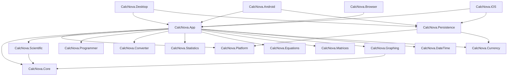

# CalcNova Architecture

## Goals

CalcNova is structured to preserve mathematical correctness, testability, accessibility, privacy, cross-platform reuse, and maintainability without adding layers merely for ceremony.

The repository uses a feature-first modular solution. Mathematical/domain libraries are pure C#/.NET; Avalonia UI and platform startup sit above them.

## Dependency direction



Platform heads remain thin. Domain projects do not reference Avalonia UI.

## Solution files

- `CalcNova.slnx` — core/application/domain/desktop/test validation graph used for normal formatter/build/test validation.
- `CalcNova.All.slnx` — records all domain/application/platform/test projects, including workload-specific Android/iOS/Browser heads.
- Platform workload builds run independently in CI so an unavailable mobile/WebAssembly workload does not hide core validation results.

## Domain projects

### CalcNova.Core

Owns the shared mathematical language and numeric primitives:

- numeric representation (`BigInteger`, decimal, finite floating fallback);
- tokenization;
- recursive-descent parsing;
- expression syntax tree;
- evaluation;
- compiled expressions with scoped variables;
- calculation session/repeated-equals semantics;
- calculator-style percentage transformation;
- classic memory model;
- typed errors;
- angle/workload options.

Core never executes user input as source code.

### CalcNova.Scientific

Organizes scientific functionality around the shared evaluator. Scientific functions include powers/roots, logs, trig/inverse/hyperbolic functions, rounding transforms, integer combinatorics, and constants.

### CalcNova.Programmer

Owns:

- base 2–36 parsing/formatting;
- fixed word-size interpretation;
- signed/unsigned two's complement;
- bitwise operations;
- shifts;
- bit visualization.

`BigInteger` is used internally so the domain model is not unnecessarily limited to machine-sized values.

### CalcNova.Converter

Owns fixed physical-unit definitions and category-safe offline conversion. Units convert through category-specific base units with multiplicative or affine transforms.

### CalcNova.Statistics

Owns descriptive-statistics calculations, compensated summation, percentiles/quartiles, variance/standard-deviation variants, and dataset result models.

### CalcNova.Equations

Owns linear/quadratic solving, complex quadratic roots, degenerate cases, and bounded numerical bisection.

### CalcNova.Matrices

Owns matrix/vector models and algorithms including determinant, inverse, rank, system solving, arithmetic, magnitude, dot product, and supported cross product.

### CalcNova.Graphing

Owns graph-safe mathematical sampling rather than UI rendering:

```text
expression
  -> shared tokenizer/parser
  -> compiled expression
  -> bounded x sampling
  -> typed evaluation
  -> invalid-domain/jump segmentation
  -> GraphSegment collection
```

It also owns viewport calculations and SVG export. The Avalonia renderer lives in `CalcNova.App`.

### CalcNova.DateTime

Owns deterministic date/duration utilities:

- `DateOnly` difference;
- business-day calculation;
- calendar add/subtract;
- fixed-duration conversion.

It intentionally avoids silently introducing time zones into date-only calculations.

### CalcNova.Currency

Owns optional network-enhanced currency abstractions:

- `ICurrencyRateProvider`;
- `ICurrencyRateCache`;
- validated timestamped rate snapshots;
- conversion/freshness/stale-fallback behavior.

No live provider key or secret belongs in the domain library.

## Platform/application contracts

### CalcNova.Platform

Contains platform-neutral application contracts/models including:

- calculation history repository and entries;
- settings repository/settings model;
- external-link launcher abstraction.

These contracts are intentionally separate from native SQLite so Browser/WebAssembly never needs to reference a native database package.

### CalcNova.Persistence

Contains native persistence implementations:

- SQLite calculation history;
- atomic JSON settings;
- JSON currency-rate cache.

Native persistence references platform/domain contracts, not Avalonia presentation code.

Browser equivalents live in the Browser head and use `localStorage` behind the same contracts.

## Shared Avalonia application

### CalcNova.App

Owns:

- shared view models;
- modular mode views;
- shared styles/design tokens;
- custom visual controls such as `GraphPlotControl`;
- clipboard/storage-picker view integration;
- application composition state;
- result display formatting;
- presentation-level parsing/validation for editable data fields.

The shared mode views live under:

```text
src/CalcNova.App/Views/Modes/
├── CalculatorModeView
├── ProgrammerModeView
├── ConverterModeView
├── StatisticsModeView
├── EquationsModeView
├── MatricesModeView
├── GraphingModeView
├── DateTimeModeView
├── CurrencyModeView
├── HistoryModeView
├── SettingsModeView
└── AboutModeView
```

`MainView` is now a small navigation/composition shell. Desktop `MainWindow` hosts this same view; Android/iOS/Browser use the single-view application lifetime. This keeps user-mode UI behavior aligned across targets.

## MVVM and code-behind rule

View models own durable UI state, validation state, and commands. Code-behind is reserved for interaction that is naturally view-specific and platform-Avalonia oriented, such as:

- key routing;
- clipboard calls;
- save-file picker interaction;
- graph fit/reset button forwarding;
- pointer rendering/interaction inside custom controls.

Mathematical decisions do not belong in code-behind.

## Application composition

Platform heads configure `AppDependencies` through `AppComposition` before starting Avalonia.

Current optional dependencies include:

- history repository;
- settings repository;
- external-link service;
- currency-rate cache;
- optional currency-rate provider.

Dependency publication uses atomic reads/writes. Shared application code handles absent optional services with user-readable states instead of platform casts.

## Parser architecture

```text
raw expression
  -> Tokenizer
  -> token sequence
  -> recursive-descent Parser
  -> Expression syntax tree
  -> ExpressionEvaluator / CompiledExpression
  -> NumberValue / typed error
```

Precedence is explicit. Exponentiation is right-associative. Unary minus has lower precedence than exponentiation, so `-2^2` evaluates as `-(2^2)`.

## Numeric strategy

`NumberValue` currently provides:

- exact `BigInteger` paths for integers;
- `decimal` paths where representable;
- finite `double` paths for transcendental/BCL math operations.

The display layer is deliberately separate from canonical numeric result strings. User preferences can apply precision/grouping to `DisplayResult` without making history/result reuse/parser input dependent on a localized formatted string.

Future rational/complex/exact-result work must preserve this separation and add regression coverage.

## Error model

Calculation failures use typed codes for syntax errors, divide-by-zero, domain errors, overflow, invalid arguments, unsupported functions, input limits, and workload limits.

Ordinary users receive human-readable error messages; stack traces remain developer diagnostics.

## Persistence strategy

### Native

- history: SQLite;
- settings: atomic JSON;
- currency rates: JSON cache;
- files stored below platform application-data locations selected by the platform head.

### Browser

- history: `localStorage` repository;
- settings: `localStorage` repository;
- currency rates: `localStorage` cache.

No cloud synchronization is enabled by default.

## History/export boundary

History data remains repository-owned. CSV formatting is pure application code (`HistoryExportFormatter`). The History view invokes Avalonia's storage-provider save picker only after explicit user action, so file-system/UI capabilities do not leak into the repository contract.

## Graphing presentation boundary

`CalcNova.Graphing` produces mathematical segments/viewports. `GraphPlotControl` renders them with Avalonia and owns pointer-specific interaction:

- grid/axes;
- segment drawing;
- drag pan;
- wheel zoom;
- coordinate text;
- double-tap/explicit fit-to-data;
- reset viewport.

The control never evaluates arbitrary user code.

## Currency boundary

Currency conversion stays optional:

```text
CurrencyViewModel
  -> CurrencyConversionService
      -> ICurrencyRateCache
      -> ICurrencyRateProvider? (optional)
```

Native/Browser caches are local. A provider can be injected by a future composition layer only when terms/credentials are appropriate. Provider failure can fall back to timestamped cache according to the domain service's policy.

## Dependency policy

Before adding a package, evaluate:

- necessity;
- maintenance activity;
- license compatibility;
- target support;
- security history;
- package size;
- API stability;
- testability.

Prefer BCL/Avalonia capabilities where sufficient.

## Architecture review rule

If a new feature would force a low-level domain project to depend on Avalonia, native platform code, or persistence implementation details, redesign the boundary instead of introducing a circular/inverted dependency.
